# Stratum: Hybrid Tree-Graph Memory Architecture

Stratum is a hybrid tree-graph neural memory engine designed for long-context AI agents. It addresses the **Stochastic Weight Interference** problem (where old states are shadowed by new weights instead of being cleanly updated) by routing all memory operations through a **Surprisal Gate** and a **Taxonomy Router**, and then performing structured tree updates combined with emergent graph-based retrieval-time stitching.

---

## 1. System Architecture Overview

```mermaid
graph TD
    %% Ingestion Pipeline
    subgraph Ingestion ["Memory Ingestion (Write)"]
        In[Input Memory] --> Norm[Perspective Normalization]
        Norm --> SG{Surprisal Gate<br>Local Causal LM}
        SG -- Low Surprisal --> Skip[Skip / Discard]
        SG -- High Surprisal --> Tax[Taxonomy LLM<br>Agentic Intent Gate]
        Tax --> Path[3-Level Radix Path<br>users/handle/subject/domain]
        Path --> Expansion[Hierarchical Expansion]
        Expansion --> Qdrant[(Qdrant Vector DB<br>Payload: Path + TS)]
        Expansion --> Redis[(Redis KV Store<br>LMCache: Path -> KV Cache)]
    end

    %% Retrieval Pipeline
    subgraph Retrieval ["Memory Retrieval (Read)"]
        Query[User Query] --> Embed[Query Embedding]
        Embed --> SemanticSearch[Semantic Search<br>Qdrant Cosine Match]
        Query --> PathPredict[Path Prediction]
        
        SemanticSearch --> RadixRerank[Radix Reranker<br>Boost overlapping paths]
        PathPredict --> RadixRerank
        
        RadixRerank --> TempStitch[Temporal Stitching<br>Retrieve ±10m window]
        RadixRerank --> RecurseSearch[Recursive Context Search<br>Traverse Tree Up/Side in Redis]
        
        TempStitch --> Context[Context Aggregator]
        RecurseSearch --> Context
        
        Context --> ChronoRerank[Chrono Re-ranking]
        ChronoRerank --> LLMGen[Response Generator<br>GPT-4o-mini / Synthesis]
        LLMGen --> Output[Final Answer]
    end
```

---

## 2. Ingestion Pipeline (The Write Path)

The ingestion pipeline determines whether a piece of information is novel enough to store, and how to structure it hierarchically:

### A. Perspective Normalization
*   **Purpose:** Standardizes the viewpoint of incoming text.
*   **Logic:** Converts first-person references into third-person (e.g., *"I am studying Rust"* $\rightarrow$ *"The user is studying Rust"*). This ensures future queries (which are usually written in the third person or ask about "the user") match the stored records semantically.

### B. Surprisal Gating
*   **Purpose:** Prevents database bloat and weight interference by filtering out redundant or already-known information.
*   **Mechanism:** Queries the local `brain_service.py` running `Qwen2.5-1.5B-Instruct` to calculate the **CrossEntropy Loss** of the new text given the existing conversation context.
*   **Decision:**
    *   If the loss is **$< 0.5$** (Low Surprisal), the text is highly predictable/redundant and is **discarded**.
    *   If the loss is **$\ge 0.5$** (High Surprisal), it contains novel information and is **stored**.

### C. Radix Path Generation (Agentic Intent Gate)
*   **Purpose:** Classifies the unstructured text into a deterministic, hierarchical category.
*   **Logic:** An LLM acts as a "neural librarian," mapping the text into a 3-level radix path:
    $$\text{users}/\{\text{user\_handle}\}/\{\text{subject}\}/\{\text{domain}\}/\{\text{detail}\}$$
    *   *Subject:* `self` (if about the user) or `entities/{name}` (if about another person/entity).
    *   *Domain:* Classified into areas like `professional`, `personal`, `social`, `health`, etc.

### D. Dual-Store Ingestion
The generated path is expanded into all its parent prefixes (e.g., `users/user/tech`, `users/user/tech/rust`, `users/user/tech/rust/basics`) and written to two database layers:
1.  **Semantic Layer (Qdrant):** Stored as an embedding vector along with metadata (the list of expanded radix paths, the text, and the epoch timestamp).
2.  **Structural Layer (Redis):** Stored as a simulated KV-cache keyed by the radix paths via the `LMCacheRedisManager`.

---

## 3. Retrieval Pipeline (The Read Path)

Retrieval dynamically reconstructs the tree and graph relationships at query time to synthesize a chronologically accurate response:

### A. Hybrid Search & Radix Reranking
1.  **Semantic Query:** The query is embedded and used to retrieve the top $N$ memories from Qdrant.
2.  **Path Prediction:** The Taxonomy LLM predicts likely paths where the answer resides.
3.  **Score Boosting:** If a retrieved memory's `radix_path` overlaps with the predicted paths, its similarity score is boosted by up to **30%**:
    $$\text{Score}_{\text{boosted}} = \text{Score}_{\text{original}} \times (1.0 + 0.3 \times \text{overlap\_ratio})$$

### B. Graph & Tree Traversal (Stitching)
To capture the surrounding context of the high-ranking memories, Stratum performs two types of stitching:
1.  **Temporal Stitching (Graph Edges):** Using the timestamp of the top retrieved memories, the engine queries Qdrant for any other memories that occurred within a $\pm$10-minute window. This forms implicit graph edges connecting events that happened together in time, regardless of their semantic category.
2.  **Recursive Context Search (Tree Walk):** The engine walks **sideways** (siblings) or **upwards** (parents) from the matched radix paths in Redis to gather wider hierarchical context.

### C. Chrono Re-ranking & Synthesis
*   All gathered memories are sorted chronologically by parsing their bracketed date headers (e.g., `[4 February, 2023]`).
*   Sorting ensures that newer states naturally succeed older states (resolving contradictions).
*   The ordered list is injected into the prompt of the generator LLM (`gpt-4o-mini`), which synthesizes the final natural language answer.
